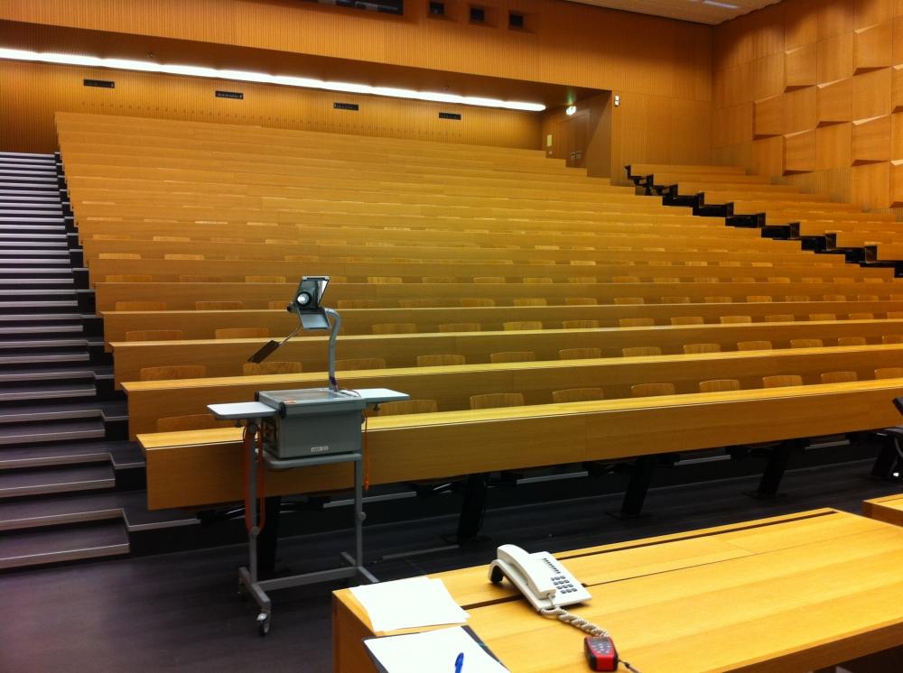

# 🏨 Venues

The EthereumZurich is divided into multiple locations within the **University of Zurich (UZH)** a few minutes' walk apart (see [Orientation map](orientation-map.md)).

* [Conference](venues.md#conference-hah-building) (main venue) - HAH building (Häldeliweg 2)
* [Hacker house](venues.md#hacker-house-glt-building) - GLT building (Gloriastrasse 12b)
* [Hacker food](venues.md#hacker-food-platte-14) - Platte 14 (Plattenstrasse 14)

## Conference - HAH building

Conference and also the hackathon registration and main announcements will be held at the UZH - HAH building.

* Address: UZH - HAH building, Häldeliweg 2, 8044 Zürich  ([Google Maps](https://goo.gl/maps/dm9gXBsVMFNhyYzc9))


All hackers automatically have free access to the conference as well!


&#x20;

## Hacker house - GLT building

A separate Hacker House will be provided in an adjacent building only 150m from the venue to allow sufficient peace and space for effective work. Four bigger work rooms with wi-fi, chairs and tables should provide enough space and privacy for all teams.

* Address: UZH - GLT building, Gloriastrasse 12b, 8032 Zürich ([Google Maps](https://goo.gl/maps/A4cAsQjujFUmsyrK6))
* Opening hours:
  * Friday 12:00 - Sunday 16:00 (nonstop)


The Hacker house will be available 24/7 for the duration of the hackathon.


## Hacker food - Platte 14

Lunch and dinner will be provided through the university cafeteria right next to the Hacker house (see orientation plan below).

Meals will be served in wider time slots, see the [schedule](schedule-overview.md), details and other options in [Food & drinks](food-and-drinks.md) section.

* Address: Platte 14, Plattenstrasse 14, 8032 Zürich ([Google Maps](https://goo.gl/maps/bvKBiFmg3ZHMPRcWA))
* Opening hours:
  * Friday 14:00 - 20:00
  * Saturday 9:00 - 20:00
  * Sunday 9:00 - 20:00

## Orientation map


[orientation-map.md](orientation-map.md)


